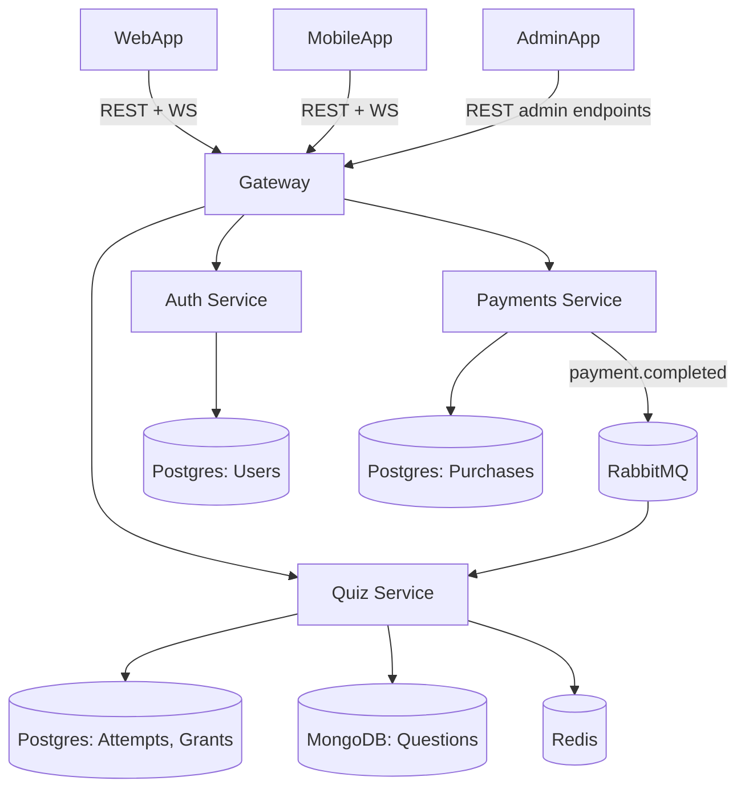

# FastQuiz — System Architecture

*Living doc. Pairs with Tech Stack, Data Model, and API Contract docs.*

## Services
| Service | Responsibility | Data owned |
|---|---|---|
| **API Gateway** | Single entry point for Web/Mobile/Admin; routes REST + WebSocket traffic to the right service | — |
| **Auth Service** | Register, login, Google OAuth, JWT issuance/refresh | Users (Postgres) |
| **Quiz Service** | Topics, quizzes, questions, attempts, free-grant tracking, server-enforced quiz timer (WebSocket) | Questions (MongoDB); Topics/Quizzes/Attempts/FreeAttemptGrant (Postgres); cache (Redis) |
| **Payments Service** | Purchases, bundle logic, payment provider webhook handling | Purchases (Postgres) |
| **Admin Review App** | Separate web app for approving/rejecting AI-generated and community-submitted questions | Reads/writes via Quiz Service's admin-scoped endpoints |

## Communication
- **Client → Gateway**: REST for all normal requests; WebSocket for the quiz-timer connection during an attempt
- **Gateway → Services**: routes to Auth/Quiz/Payments based on path
- **Service → Service (sync)**: REST — e.g. Payments Service validates a user by calling Auth Service
- **Service → Service (async)**: RabbitMQ as the message broker (pairs with Celery for background workers, consistent with your existing Celery experience)

## Key Async Flow: Payment → Unlock
1. Client initiates purchase → Payments Service creates a `pending` Purchase, returns provider checkout session
2. Payment provider confirms via webhook → Payments Service marks Purchase `completed`
3. Payments Service publishes `payment.completed` event to RabbitMQ
4. Quiz Service consumes the event → unlocks explanations for that quiz/bundle for the user
5. Next `/attempts/:id/submit` call from that user returns unlocked explanations

## Real-Time Quiz Timer
- Client opens a WebSocket to Quiz Service (via Gateway) when calling `/quizzes/:id/start`
- Quiz Service tracks attempt start time server-side and pushes remaining-time ticks
- On expiry, Quiz Service force-submits the attempt with whatever answers were received — prevents client-side timer tampering

## Service Boundaries
- No service reads another service's database directly — always via REST call or event, so services can evolve/scale independently
- Auth Service is the single source of truth for identity; other services trust its JWTs (validated via shared public key, no need to call Auth Service on every request)

## Diagram

## Deployment
- Each service: its own Docker container, deployed on ECS Fargate
- GitHub Actions: independent build/test/deploy pipeline per service
- API Gateway: AWS-managed API Gateway vs. self-hosted (Kong/Traefik) — open decision (see below)

## Open Questions
- API Gateway: use AWS-managed API Gateway, or self-host one (Kong/Traefik/custom)?
- Does the Admin Review App need its own auth flow, or reuse Auth Service with an `admin` role on the JWT?